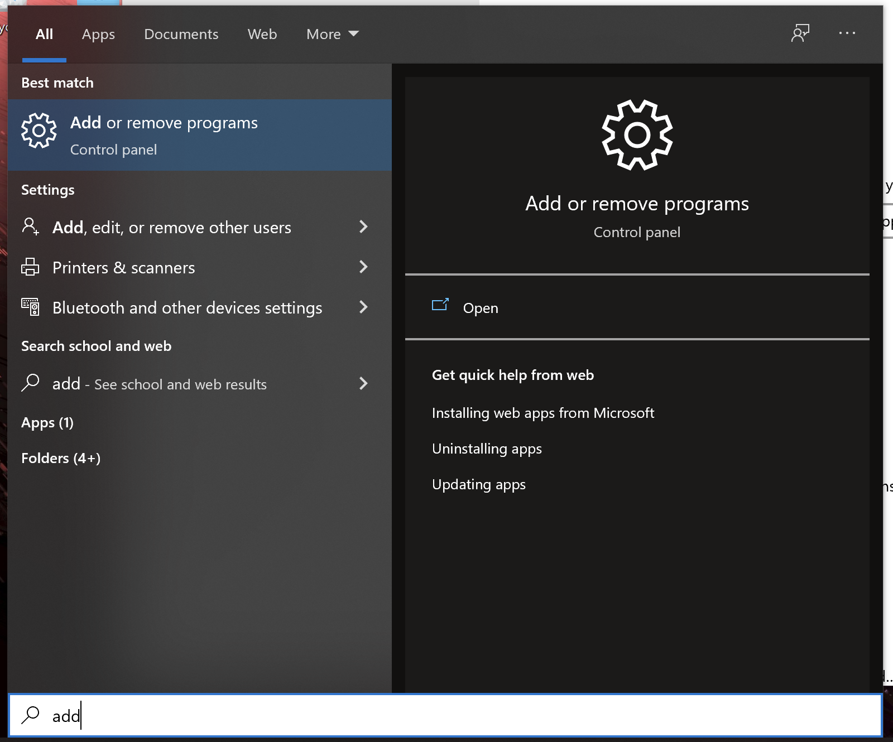
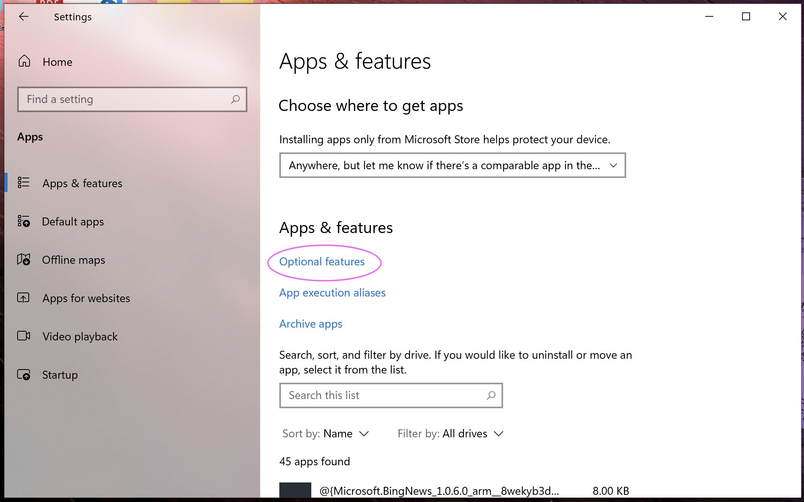
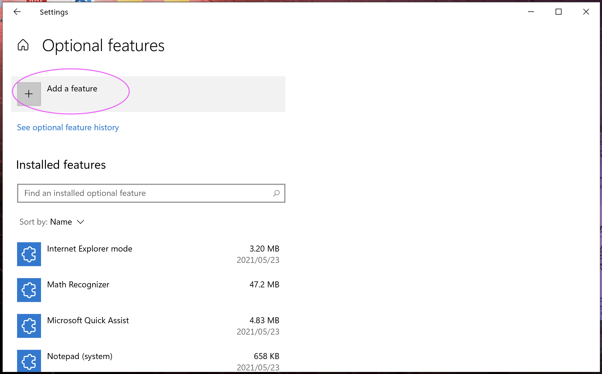
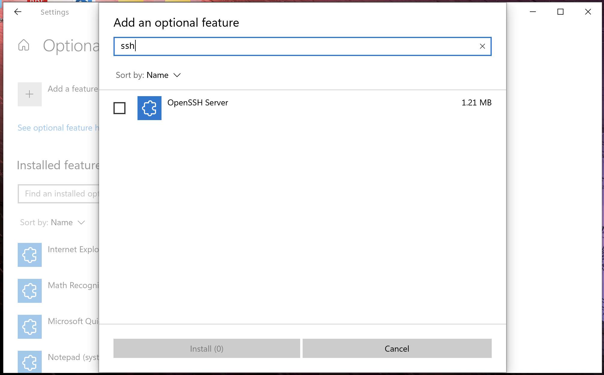

# SSH on Windows using PowerShell

## Turn on the OpenSSH option

1. Press Windows button and type 'add' directory. Then open "Add or remove programs".


2. Press "Optional features"


3. Press "Add a features"


4. Search "SSH". Then install ***"OpenSSH Client"*** (NOT Open SSH Server like the below figure)


5. Reopen PowerShell and make sure the ssh command is avairable.
```shell
ssh
```
If there is no error, ssh client is successfly installed. Congrats🎉