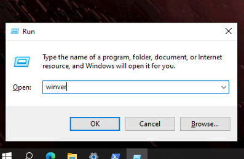

# How to install WSL2 on your machine

WSL2 (Windows Subsystem on Linux 2) is a powerful tool when you develop on your Windows environment. WSL2 allows you to use a virtual Linux distribution when you use Windows machine.

## How to install
### Make sure your OS build version

1. Press "Windows button"
2. Type "winver" in the box and click "OK".

3. Make sure that the OS build number is 19041 or higher, and Windows version is 2004 or higher (As of December 2, 2021, the following versions are covered in this manual.).

version|OS build
:---:|:---:
2004|19041
20H2|19042
21H1|19043
21H2|19044

4. If the build number is different from the above mentioned one, please do a Windows Update or ask Kaneko directly for help.

## Open wsl as an administrator


1. Press Windows-button and type "powershell" directly.
2. Click "Run as administrator" and allow "User acount control".
3. You can find that you oepn PowerShell as an administrator.


## Let's install WSL2
Now, let's install WSL2! Installation is much easier than it used to be.


Please type a command below in PowerShell.
```shell
wsl --list --online
```
Then you can find what Linux distribution is avairable on the installer.

In this manual, we will install "Ubuntu 18.04 LTS."

Type a command below.
```shell
wsl --install -d Ubuntu-18.04
```

All you have to do is wait, and your PC will automatically download Ubuntu and install WSL for you. So elegant👍

## Reboot
Please reboot your PC.

## User settings on Ubuntu.
Press "Windows button" and type "ubuntu" directly. Ubuntu environment will be launched.

Follow the instructions on the screen to set up your user name and password.

Then you can use WSL2 just type
```shell
wsl
```
on your command prompt or powershell.

Congrats!

## Recommendation
[Windows Terminal](https://www.microsoft.com/ja-jp/p/windows-terminal/9n0dx20hk701?activetab=pivot:overviewtab) is an usefule tool.


